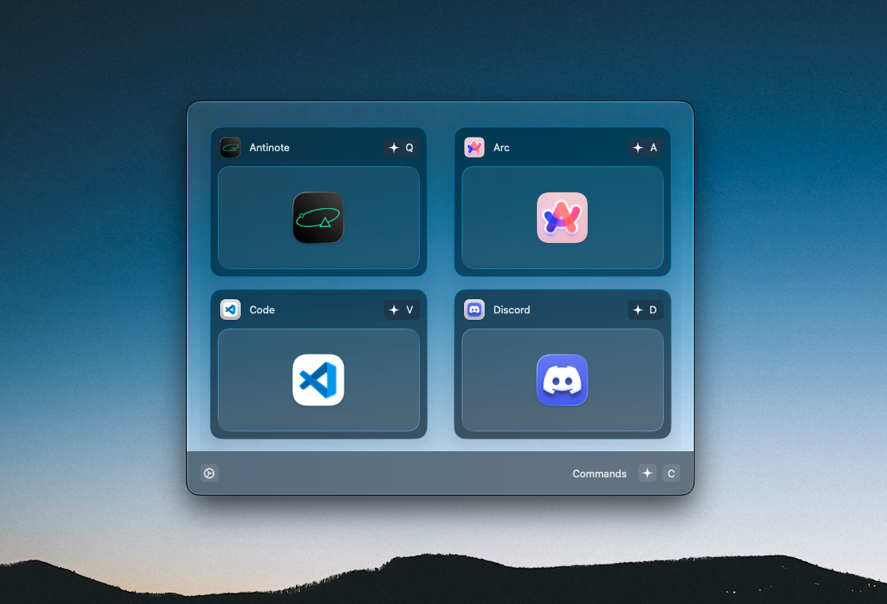

<h1 align="center">Keypath</h1>

A personal macOS app that allows for easy navigation across your apps via keybinds.

### About The Project

Keypath was made for one primary reason: effortless app switching via keybinds. As a multiple virtual desktop user, switching between desktops and then focusing said-so app into focus has never been easier. Sure, there are probably similar applications like Keypath, but as a developer, I knew exactly what I wanted and Keypath does it just fine. 

### Commands

#### Hyper Key

In order to simplify key detection, the hyper key consists of double tapping control and is represented as a superellipse:

` ⌃⌃ `

#### Opening/Closing

` ⌃ K `

#### Commands

` ⌃ C `

#### Keybinds

` ⌃ / `