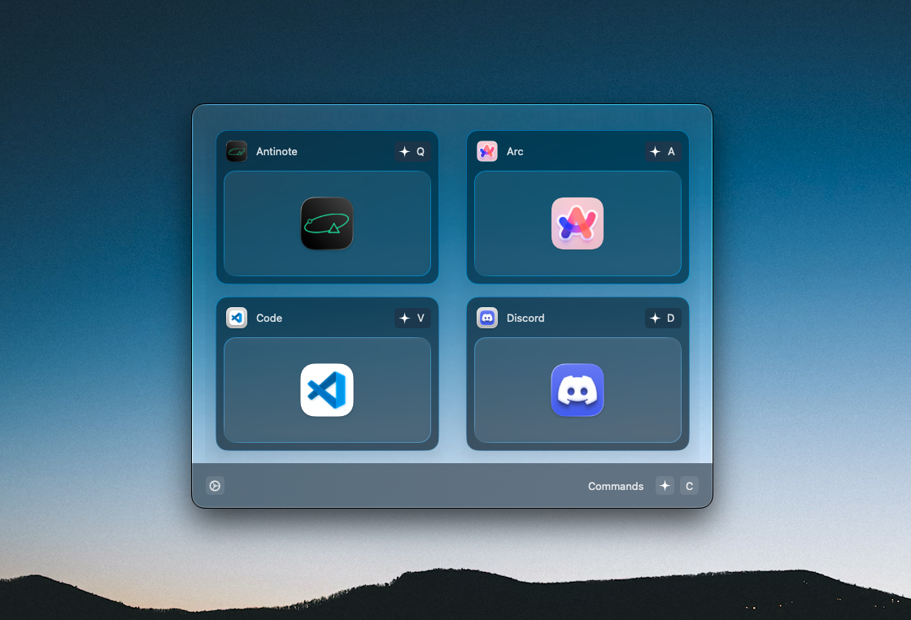

<h1 align="center">Keypath</h1>

A personal macOS app that allows for easy navigation across your apps via keybinds.

### About The Project

Keypath is a menu bar utility for switching between running Mac apps from the keyboard. macOS handles moving focus to an app on another Space; Keypath does not move windows between Spaces.

Window previews require Screen Recording permission. Choose **Request Screen Recording Access** from the menu bar menu, then grant access and restart the app. Debug and Release have separate permissions. If the prompt only opens System Settings and Keypath Debug is absent, use **+** in Screen & System Audio Recording to add Xcode's built `Keypath Debug.app`, enable it, and restart Keypath Debug.

### Commands

#### Hyper Key

The Hyper Key is a quick double tap of the **left Option** key. It is represented by a superellipse:

`⌃⌃`

#### Open or close the app HUD

` ⌃⌃ K `

#### Recent apps

` ⌃⌃ Tab ` opens the recent-app picker. `Tab` moves forward, `Shift-Tab` moves backward, `Return` switches to the selected app, and `Escape` closes the picker.

#### App windows

After the Hyper Key, press a running app's assigned letter. One accessible window activates directly; apps with multiple accessible windows open a two-column chooser with a preview card for each window. The cards show the app's binding and a page-local number. For example, `⌃⌃ D 2` selects the second window of an app assigned to `D`. Press `1`–`9` to select a window on the current page, `Tab` or `Shift-Tab` to change pages, and `Escape` to cancel and return to the app that was active before the chooser opened. The focused window appears first; minimized windows are included and restored when selected. With no accessible windows, Keypath activates the app.

#### Other commands

| Shortcut | Action |
| --- | --- |
| `⌃⌃ C` | Show or hide the command reference while the HUD is open |
| `⌃⌃ /` | Show or hide saved app keybinds |
| `⌃⌃ S` | Toggle selection mode; use arrow keys to move through the app grid |
| `⌃⌃ U` | Assign a keybind to the selected app; press a supported letter or number |
| `Escape` | Cancel keybind entry or close the app HUD |

When assigning a key that belongs to another app, Keypath asks before moving it. After a successful assignment or reset, an Undo action is available in the HUD for 30 seconds. Press `Tab` to focus Undo, then `Return` or `Enter` to restore the previous bindings.
