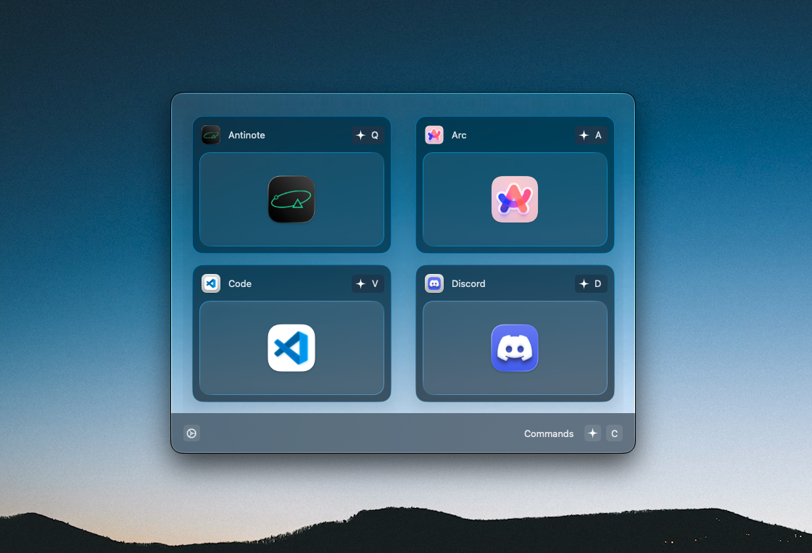

<h1 align="center">Keypath</h1>

A personal macOS app that allows for easy navigation across your apps via keybinds.

### About The Project

Keypath is a menu bar utility for switching between running Mac apps from the keyboard. macOS handles moving focus to an app on another Space; Keypath does not move windows between Spaces.

Window previews require Screen Recording permission. Choose **Request Screen Recording Access** from the menu bar menu, then grant access and restart Keypath.

### Commands

#### Hyper Key

The Hyper Key is a quick double tap of the **left Option** key. It is represented by a superellipse:

`⌃⌃`

#### Open or close the app HUD

` ⌃⌃ K `

#### Recent apps

` ⌃⌃ Tab ` opens the recent-app picker. `Tab` moves forward, `Shift-Tab` moves backward, `Return` switches to the selected app, and `Escape` closes the picker.

#### App windows

After the Hyper Key, press a running app's assigned letter. A single-window app switches directly to its window; pressing its key while that app is already frontmost minimizes the window. Apps with multiple windows open a two-column chooser with a preview card for each window. The focused window appears first, and each page shows up to nine windows. The cards show the app's binding and a page-local number. For example, `⌃⌃ D 2` opens the chooser for the app assigned to `D` and activates its second window on the current page. `Tab` selects the next window and `Shift-Tab` selects the previous one, wrapping through the full list and following the selection across pages. Press `Return` or `Enter` to activate the selected window. You can also press `1`–`9` to activate a window on the current page immediately. `Escape` cancels and returns to the app that was active before the chooser opened. Minimized windows are included and restored when selected. If an app has no windows, Keypath activates it.

#### Customize the app grid

Use the grid menu in the HUD's bottom bar to choose 2, 3, or 4 columns. Keypath remembers your choice. In selection mode (`⌃⌃ S`), left and right arrows move one app at a time; up and down move by the selected number of columns.

#### Other commands

| Shortcut | Action |
| --- | --- |
| `⌃⌃ C` | Show or hide the command reference while the HUD is open |
| `⌃⌃ /` | Show or hide saved app keybinds |
| `⌃⌃ S` | Toggle selection mode; use arrow keys to move through the app grid |
| `⌃⌃ U` | Assign a keybind to the selected app; press a supported letter or number |
| `Escape` | Cancel keybind entry or close the app HUD |

When assigning a key that belongs to another app, Keypath asks before moving it. After a successful assignment or reset, an Undo action is available in the HUD for 30 seconds. Press `Tab` to focus Undo, then `Return` or `Enter` to restore the previous bindings.
